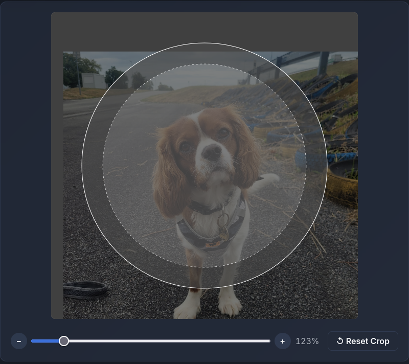

# Pinmaker

Generate clean, printable pin sheets directly in your browser.

https://pinmaker.vokracko.cz

Pinmaker is a lightweight tool for laying out and exporting pin designs for physical printing. Drop in your graphics, adjust the layout, and generate ready-to-print sheets without installing any software.

## Features

* Browser-based, no installation required
* Fast pin sheet generation
* Printable output
* Remembers picture settings (zoom, position) across reloads

## Usage

1. Open https://pinmaker.vokracko.cz
2. Add your artwork
3. Adjust size and layout settings
4. Set number of pins
5. Export and print

